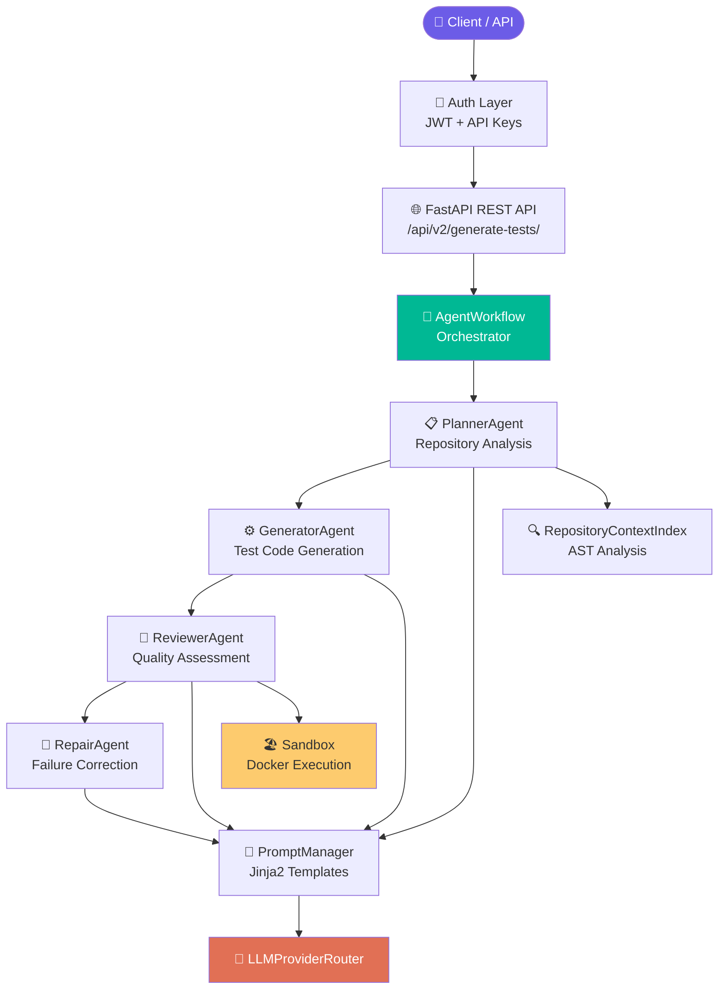
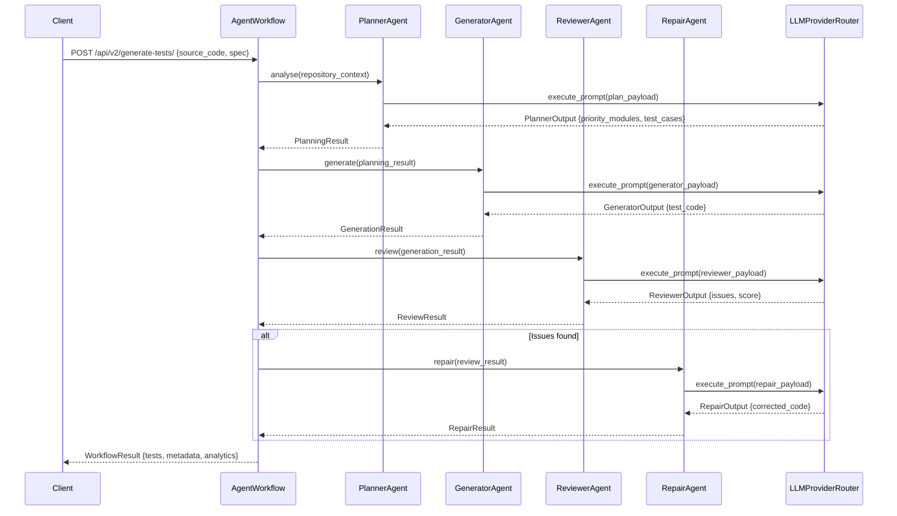
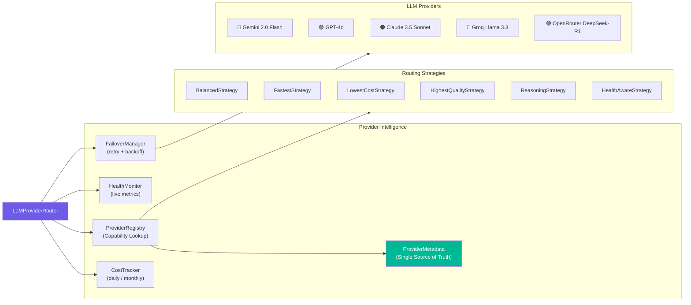

<div align="center">

# 🧪 TestGen AI

### Production-Ready Multi-Agent AI Framework for Automated Test Generation

*Automate test generation using a coordinated pipeline of specialized AI agents across multiple LLM providers — from planning through review and conditional repair.*

---

[](https://python.org)
[](https://fastapi.tiangolo.com)
[](CHANGELOG.md)
[](#testing)

[](https://ai.google.dev)
[](https://openai.com)
[](https://anthropic.com)
[](https://groq.com)
[](https://openrouter.ai)

</div>

## Overview

TestGen AI is a **multi-agent AI framework** that automates the generation of software test suites for Python codebases. It decomposes the test generation problem into four specialized agents — Planner, Generator, Reviewer, and Repair — each powered by the LLM provider best suited for the task.

The system is built for software teams looking to automate repetitive test authoring. It analyses available repository structure and source-code context (imports, functions, fixtures, dependencies) using static AST parsing, generates structured test code, evaluates it through an independent review step, and conditionally invokes the RepairAgent when the review is not approved — all in a single workflow.

**What makes it different from a simple "ask ChatGPT to write tests" approach:**

- A dedicated **Planner** agent analyses repository structure and identifies the highest-priority test targets
- A **Generator** agent produces structured test code following project conventions
- A **Reviewer** agent assesses quality, coverage, and correctness
- A **Repair** agent performs LLM-driven surgical refinement of tests that the Reviewer has not approved
- An **enterprise-oriented provider intelligence layer** routes requests across 5 LLMs with health monitoring, automatic failover, and cost tracking — helping maintain availability when an individual provider fails or becomes degraded

---

## Key Features

| Feature                               | Description                                                                  |
| ------------------------------------- | ---------------------------------------------------------------------------- |
| 🤖**Multi-Agent Workflow**      | Four coordinated agents: Planner → Generator → Reviewer → Repair          |
| 🔍**Repository Context Engine** | Static AST-based analysis: imports, functions, classes, fixtures, dependencies |
| 📝**Prompt Management**         | Jinja2-powered template system with per-agent, per-domain templates          |
| 🔀**Multi-Provider Routing**    | 5 LLM providers with pluggable routing strategies                            |
| 📋**Provider Registry**         | Central metadata registry — capabilities, costs, latency per provider       |
| 📡**Streaming**                 | Token-level streaming via`stream_generate()` on all providers              |
| 🏥**Health Monitoring**         | Live per-provider metrics: uptime %, p95 latency, failure rate, health score |
| 💰**Cost Tracking**             | Per-request, daily, monthly, and per-workflow cost accumulation              |
| 🔄**Automatic Failover**        | Exponential backoff retry with per-error-type retry policy                   |
| 🧠**Intelligent Routing**       | 6 strategies including HealthAware, Reasoning, Fastest, LowestCost           |
| 📊**Analytics**                 | Serializable dashboard models: health, usage, cost, latency, traces          |
| 🔐**Authentication**            | JWT-based auth with Argon2 password hashing and API key management           |
| 🏖️**Sandbox Execution**       | Isolated Docker-based test execution environment                             |
| 🌐**REST API**                  | Full FastAPI with Swagger UI, versioned endpoints (v1 + v2)                  |
| 📈**Benchmarking**              | Comparative evaluation across providers and strategies                       |
| ✅**703 Passing Tests**         | Offline-first test suite with deterministic mock mode                        |

---

## Architecture

### High-Level System Architecture



### Multi-Agent Workflow



### Enterprise Provider Layer (v2.4)



---

## Provider Ecosystem

| Provider                         | Streaming | JSON | Vision | Reasoning |     Context | Configured Typical Latency | Configured Quality Score |
| -------------------------------- | :-------: | :--: | :----: | :-------: | ----------: | -------------------------: | :----------------------: |
| **Gemini 2.0 Flash**       |    ✅    |  ✅  |   ✅   |    ✅    |   1M tokens |                     ~800ms |           0.88           |
| **OpenAI GPT-4o**          |    ✅    |  ✅  |   ✅   |    ✅    | 128K tokens |                    ~1200ms |           0.92           |
| **Claude 3.5 Sonnet**      |    ✅    |  ✅  |   ✅   |    ✅    | 200K tokens |                    ~1500ms |           0.94           |
| **Groq Llama 3.3**         |    ✅    |  ✅  |   ❌   |    ❌    | 128K tokens |                     ~250ms |           0.82           |
| **OpenRouter DeepSeek-R1** |    ✅    |  ✅  |   ❌   |    ✅    | 128K tokens |                    ~2000ms |           0.86           |

> **Note:** Latency and quality values are routing configuration metadata defined in `provider_metadata.py` and used by routing strategies. They are not independently benchmarked measurements from this project. Actual provider performance will vary.

All providers operate in **mock mode** for offline testing with deterministic, reproducible responses. Switch to real mode by setting the corresponding API key.

---

## Routing Strategies

TestGen AI ships with six routing strategies. All decisions flow through the `ProviderRegistry` — no strategy hardcodes provider names.

| Strategy                   | Selection Logic                                       | Best For                      |
| -------------------------- | ----------------------------------------------------- | ----------------------------- |
| `BalancedStrategy`       | Default: balanced speed, quality, cost                | General use                   |
| `FastestStrategy`        | Lowest`typical_latency_ms` in registry              | Interactive / streaming       |
| `LowestCostStrategy`     | Lowest`estimated_input_cost` in registry            | High-volume batch jobs        |
| `HighestQualityStrategy` | Highest`quality_score` in registry                  | Critical production code      |
| `ReasoningStrategy`      | Filters`supports_reasoning=True`, then best quality | Complex logic, algorithms     |
| `HealthAwareStrategy`    | Excludes providers above failure/latency thresholds   | High-availability deployments |

```python
# Select strategy per request
from app.infrastructure.routing_strategies import HealthAwareStrategy

strategy = HealthAwareStrategy(failure_threshold=0.3, latency_threshold_ms=5000)
response = router.execute_prompt(payload, strategy=strategy)
```

---

## Project Structure

```
TestGenAI/
├── backend/
│   ├── app/
│   │   ├── agents/                    # Multi-agent implementations
│   │   │   ├── planner.py             # PlannerAgent
│   │   │   ├── generator.py           # GeneratorAgent
│   │   │   ├── reviewer.py            # ReviewerAgent
│   │   │   └── repair.py              # RepairAgent
│   │   ├── api/
│   │   │   ├── v1/                    # v1 REST endpoints
│   │   │   └── v2/                    # v2 REST endpoints (current)
│   │   ├── core/
│   │   │   └── config.py              # Pydantic Settings (all env vars)
│   │   ├── domain/
│   │   │   ├── v23_models.py          # Core domain models
│   │   │   └── provider_response.py   # Unified ProviderResponse
│   │   ├── infrastructure/
│   │   │   ├── providers/
│   │   │   │   ├── provider_metadata.py    # ★ Central provider registry
│   │   │   │   ├── provider_registry.py    # Capability lookup & filtering
│   │   │   │   ├── health_monitor.py       # In-memory health tracking
│   │   │   │   ├── failover.py             # Retry + failover manager
│   │   │   │   ├── cost_tracker.py         # Cost accumulation
│   │   │   │   ├── analytics_models.py     # Dashboard domain models
│   │   │   │   ├── streaming.py            # StreamChunk + helpers
│   │   │   │   ├── router.py               # LLMProviderRouter (enterprise)
│   │   │   │   ├── gemini.py               # GeminiProvider
│   │   │   │   ├── openai_provider.py      # OpenAIProvider
│   │   │   │   ├── claude.py               # ClaudeProvider
│   │   │   │   ├── groq_provider.py        # GroqProvider
│   │   │   │   └── openrouter_provider.py  # OpenRouterProvider
│   │   │   └── routing_strategies/
│   │   │       ├── strategies.py           # v2.3 strategies (5)
│   │   │       └── extended_strategies.py  # v2.4 strategies (5 new)
│   │   ├── prompts/                   # Jinja2 prompt templates
│   │   ├── workflows/                 # AgentWorkflow orchestrator
│   │   ├── context/                   # RepositoryContextIndex
│   │   ├── quality/                   # Quality pipeline & metrics
│   │   ├── evaluation/                # Benchmarking engine
│   │   ├── sandbox/                   # Docker execution environment
│   │   └── auth/                      # JWT + API key management
│   ├── tests/
│   │   └── v2/                        # 34 test modules, 703 tests
│   ├── sandbox/                       # Docker sandbox image
│   └── requirements.txt
├── frontend/                          # Web UI
├── docs/                              # Documentation
└── README.md
```

---

## Installation

### Prerequisites

- Python 3.11+
- Docker (optional — for sandbox test execution)

### Backend Setup

```bash
# 1. Clone the repository
git clone https://github.com/your-org/testgen-ai.git
cd testgen-ai/backend

# 2. Create and activate virtual environment
python -m venv .venv

# Windows
.venv\Scripts\activate

# macOS / Linux
source .venv/bin/activate

# 3. Install dependencies
pip install -r requirements.txt

# 4. Configure environment variables
cp ../.env.example .env
# Edit .env with your API keys (see Configuration section)

# 5. Run database migrations
alembic upgrade head

# 6. Start the FastAPI server
uvicorn app.main:app --reload --port 8000
```

The API will be available at `http://localhost:8000`.
Interactive Swagger docs: `http://localhost:8000/docs`

### Docker Sandbox (optional)

```bash
# Build the isolated test execution sandbox
docker build -t testgen-sandbox:latest ./sandbox
```

---

## Configuration

All configuration is managed via environment variables loaded by Pydantic Settings.

### Core Settings

```ini
# .env

# ── Application ───────────────────────────────────────────────
ENVIRONMENT=development          # development | testing | production
SECRET_KEY=your-secret-key
DATABASE_URL=sqlite:///./testgen.db

# ── Provider Mode ─────────────────────────────────────────────
# true  = deterministic mock responses (no network, ideal for CI)
# false = real API calls (requires API keys below)
MOCK_MODE=false

# ── LLM Provider API Keys ─────────────────────────────────────
GEMINI_API_KEY=AIza...           # https://ai.google.dev
GEMINI_MODEL=gemini-2.0-flash

OPENAI_API_KEY=sk-...            # https://platform.openai.com
OPENAI_MODEL=gpt-4o

ANTHROPIC_API_KEY=sk-ant-...     # https://console.anthropic.com
CLAUDE_MODEL=claude-3-5-sonnet-20241022

GROQ_API_KEY=gsk_...             # https://console.groq.com (free tier)
GROQ_MODEL=llama-3.3-70b-versatile

OPENROUTER_API_KEY=sk-or-...     # https://openrouter.ai
OPENROUTER_MODEL=deepseek/deepseek-r1

# ── Enterprise Provider Intelligence (v2.4) ───────────────────
ENABLE_STREAMING=true
ENABLE_FAILOVER=true
ENABLE_HEALTH_MONITOR=true
ENABLE_COST_TRACKING=true

MAX_PROVIDER_RETRIES=2
PROVIDER_TIMEOUT_SECONDS=30.0

HEALTH_FAILURE_THRESHOLD=0.5     # exclude providers above this failure rate
HEALTH_LATENCY_THRESHOLD=10000.0 # exclude providers above this avg latency (ms)

# Options: BalancedStrategy | FastestStrategy | LowestCostStrategy |
#          HighestQualityStrategy | ReasoningStrategy | HealthAwareStrategy
ROUTING_STRATEGY=BalancedStrategy
```

**Offline / CI mode:** Set `MOCK_MODE=true` and leave all API keys blank. The test suite enforces this automatically via `pytest.ini`.

---

## Usage Examples

### Generate Tests via REST API

```bash
curl -X POST http://localhost:8000/api/v2/generate-tests/ \
  -H "Content-Type: application/json" \
  -H "Authorization: Bearer <your-token>" \
  -d '{
    "source_code": "def add(a: int, b: int) -> int:\n    return a + b",
    "specification": "Function that adds two integers",
    "language": "python",
    "framework": "pytest"
  }'
```

<details>
<summary>Illustrative Example Response (field names are accurate; values are representative, not from a recorded run)</summary>

```json
{
  "workflow_id": "wf-a3f9c2d1",
  "request_id": "...",
  "status": "completed",
  "generated_test_count": 4,
  "repair_count": 0,
  "review_score": 91.5,
  "approved": true,
  "total_execution_ms": "<pipeline wall-clock time>",
  "estimated_cost_usd": "<cumulative LLM cost estimate>",
  "generated_tests": ["..."],
  "review_report": {"is_approved": true, "overall_score": 91.5, "issues": []},
  "repair_history": [],
  "reasoning_traces": ["..."],
  "provider_decisions": ["..."],
  "repository_metadata": {"...": "..."},
  "test_plan_summary": {"...": "..."}
}
```

</details>

### Streaming (Provider / Router Level)

Streaming is supported at the Python provider and router level via `stream_generate()` on all five providers. There is no dedicated streaming REST endpoint in the current release — the `POST /api/v2/generate-tests/` endpoint returns the complete result synchronously.

<details>
<summary>Python streaming client example (direct router usage)</summary>

```python
from app.infrastructure.providers.router import LLMProviderRouter
from app.domain.v23_models import PromptPayload

router = LLMProviderRouter()

payload = PromptPayload(
    template_name="generator",
    rendered_system="You are an expert test engineer.",
    rendered_user="Generate pytest tests for: def add(a, b): return a + b",
    agent_name="generator",
    estimated_tokens=150,
)

# Stream tokens as they arrive
for chunk in router.stream_execute_prompt(payload):
    print(chunk.delta, end="", flush=True)
    if chunk.is_final:
        print(f"\n\n[{chunk.total_tokens} tokens | ${chunk.estimated_cost:.6f}]")
```

</details>

### Switch Routing Strategy Per Request

```python
from app.infrastructure.providers.router import LLMProviderRouter
from app.infrastructure.routing_strategies import (
    FastestStrategy,
    HealthAwareStrategy,
    ReasoningStrategy,
)

router = LLMProviderRouter()

# For latency-sensitive requests
response = router.execute_prompt(payload, strategy=FastestStrategy())

# For complex algorithmic code (prefers reasoning-capable models)
response = router.execute_prompt(payload, strategy=ReasoningStrategy())

# Automatically avoid degraded providers
response = router.execute_prompt(
    payload,
    strategy=HealthAwareStrategy(failure_threshold=0.3)
)
```

### Provider Analytics

```python
analytics = router.get_analytics()

print(f"Total cost today: ${analytics['cost']['daily_total_usd']:.4f}")
print(f"Total requests:   {analytics['cost']['total_requests']}")

for provider, health in analytics["health"].items():
    print(f"{provider:12} uptime={health['uptime_percentage']:.1f}%  "
          f"p95={health['p95_latency_ms']:.0f}ms  "
          f"score={health['health_score']:.3f}")
```

---

## Example Workflow

```
1. Client submits source_code + specification
        │
        ▼
2. PlannerAgent analyses repository context
   → identifies: priority_modules, target_functions, test_cases
        │
        ▼
3. GeneratorAgent produces structured test code
   → applies project conventions from RepositoryContextIndex
        │
        ▼
4. ReviewerAgent assesses quality
   → checks: coverage, assertions, edge cases, naming
        │
   ┌────┴────┐
   │  Review │ → RepairAgent performs LLM-driven
   │ approved│   surgical refinement (if NOT approved)
   └────┬────┘
        │ Approved / no repair needed
        ▼
5. WorkflowResult returned
   → generated_tests, quality_score, provider_analytics, cost_summary
```

---

## Testing

TestGen AI maintains a **703-test suite** that runs entirely offline — no API keys, no network access required.

```bash
# Run all tests (offline, mock mode enforced via pytest.ini)
pytest tests/v2/ -q

# Run only v2.4 enterprise provider tests
pytest tests/v2/test_v24_enterprise_providers.py -v

# Run with coverage report
pytest tests/v2/ --cov=app --cov-report=term-missing

# Run specific test class
pytest tests/v2/test_v24_enterprise_providers.py::TestProviderHealthMonitor -v
```

### Test Coverage by Module

| Test File                            | Coverage Area                |         Tests |
| ------------------------------------ | ---------------------------- | ------------: |
| `test_v24_enterprise_providers.py` | Provider intelligence (v2.4) |           125 |
| `test_v23_e2e_pipeline.py`         | End-to-end workflow          |           ~50 |
| `test_v23_provider_framework.py`   | Provider routing             |           ~40 |
| `test_v23_planner_agent.py`        | PlannerAgent                 |           ~35 |
| `test_v23_generator_agent.py`      | GeneratorAgent               |           ~35 |
| `test_v23_reviewer_agent.py`       | ReviewerAgent                |           ~40 |
| `test_v23_repair_agent.py`         | RepairAgent                  |           ~40 |
| `test_v23_prompt_manager.py`       | PromptManager                |           ~35 |
| `test_phase4.py`                   | Quality pipeline             |          ~100 |
| `test_auth.py`                     | Authentication               |           ~60 |
| + 24 more                            | ...                          |          ~143 |
| **Total**                      |                              | **703** |

**Mock mode** guarantees deterministic test output. Every provider returns a structured JSON response with realistic token counts and cost estimates, with zero network dependency.

---

## Performance

All in-process provider orchestration components are designed to be lightweight. No specific latency benchmarks have been independently measured for this project; the characterisations below are qualitative.

| Component | Characteristic |
| --------- | -------------- |
| `ProviderRegistry.rank_by()` | In-memory sort over a small fixed list (5 providers) |
| `HealthAwareStrategy.select_provider()` | In-memory filter + sort over provider health metrics |
| `ProviderHealthMonitor.record_outcome()` | Thread-safe in-memory counter increment |
| `ProviderCostTracker.record()` | Thread-safe in-memory accumulator update |
| `ProviderFailoverManager` (no retry path) | Single pass-through to provider, no additional overhead |

Dominant latency in any request is the upstream LLM API round-trip. The values below are the **configured** `typical_latency_ms` metadata entries from `provider_metadata.py` — they are routing heuristics, not independently measured benchmarks.

| Provider                 | Configured Typical Latency |
| ------------------------ | -------------------------: |
| Groq (Llama 3.3)         | ~250ms                     |
| Gemini 2.0 Flash         | ~800ms                     |
| OpenAI GPT-4o            | ~1200ms                    |
| Claude 3.5 Sonnet        | ~1500ms                    |
| OpenRouter (DeepSeek-R1) | ~2000ms                    |

---

## Extending TestGen AI

The architecture follows the **Open/Closed Principle** — extend without modifying existing code.

### Adding a New Provider (e.g. Mistral)

**Step 1: Add metadata** in `app/infrastructure/providers/provider_metadata.py`

```python
"Mistral": ProviderMetadata(
    provider_name="Mistral",
    default_model="mistral-large-latest",
    context_window=128_000,
    max_output_tokens=4_096,
    supports_streaming=True,
    supports_json=True,
    supports_vision=False,
    supports_function_calling=True,
    supports_reasoning=False,
    estimated_input_cost=0.002,      # $2.00 / 1M tokens
    estimated_output_cost=0.006,     # $6.00 / 1M tokens
    typical_latency_ms=900.0,
    quality_score=0.85,
    availability="production",
),
```

**Step 2: Implement** `app/infrastructure/providers/mistral_provider.py`

```python
from app.infrastructure.providers.base import BaseLLMProvider

class MistralProvider(BaseLLMProvider):
    def __init__(self, model_name="mistral-large-latest", api_key="", mock_mode=False):
        super().__init__("Mistral", model_name, cost_per_1k_input=0.002, cost_per_1k_output=0.006)
        self.api_key = api_key
        self.mock_mode = mock_mode or not bool(api_key)

    def generate(self, prompt_payload, options=None):
        if self.mock_mode:
            return self._generate_mock(prompt_payload)
        return self._generate_real(prompt_payload, options or {})

    def stream_generate(self, prompt_payload, options=None):
        from app.infrastructure.providers.streaming import stream_from_response
        # Implement real streaming or fall back:
        yield from stream_from_response(self.generate(prompt_payload, options))
```

**Step 3: Register** in `app/infrastructure/providers/router.py`

```python
self.register_provider(MistralProvider(
    model_name=cfg.MISTRAL_MODEL,
    api_key=cfg.MISTRAL_API_KEY,
    mock_mode=resolved_mock,
))
```

**Nothing else changes** — HealthMonitor, FailoverManager, CostTracker, all routing strategies, REST APIs, and agents automatically support the new provider.

---

## Technology Stack

| Layer                        | Technology                   | Version  |
| ---------------------------- | ---------------------------- | -------- |
| **Web Framework**      | FastAPI                      | 0.115.12 |
| **ASGI Server**        | Uvicorn                      | 0.34.3   |
| **Data Validation**    | Pydantic + Pydantic-Settings | 2.11.4   |
| **Database ORM**       | SQLAlchemy                   | 2.0.41   |
| **Migrations**         | Alembic                      | 1.16.2   |
| **Structured Logging** | structlog                    | 25.4.0   |
| **Templating**         | Jinja2                       | 3.1.6    |
| **Authentication**     | PyJWT + Argon2               | —       |
| **HTTP Client**        | httpx                        | 0.28.1   |
| **Async Support**      | anyio                        | 4.14.2   |
| **Gemini SDK**         | google-genai                 | 1.33.0   |
| **OpenAI SDK**         | openai                       | ≥1.40.0 |
| **Anthropic SDK**      | anthropic                    | ≥0.34.0 |
| **Groq SDK**           | groq                         | ≥0.9.0  |
| **Testing**            | pytest + pytest-env          | —       |
| **Containerization**   | Docker                       | —       |
| **Language**           | Python                       | 3.11+    |

---

## Roadmap

### Completed

| Version            | Highlights                                                                                                       |
| ------------------ | ---------------------------------------------------------------------------------------------------------------- |
| ✅**v2.0**   | FastAPI foundation, database models, authentication, REST API v1                                                 |
| ✅**v2.1**   | Multi-agent framework: Planner, Generator, Reviewer, Repair                                                      |
| ✅**v2.2**   | Repository Context Engine, PromptManager, Jinja2 templates                                                       |
| ✅**v2.3**   | Multi-LLM routing: Gemini + OpenAI + Claude, provider abstraction                                                |
| ✅**v2.3.1** | Groq + OpenRouter providers, offline-first test suite (703 tests)                                                |
| ✅**v2.4.0** | Enterprise Provider Intelligence: streaming, health monitoring, registry-driven routing, failover, cost tracking |

### Planned

| Version          | Focus                                                                          |
| ---------------- | ------------------------------------------------------------------------------ |
| 🔲**v3.0** | Repository Knowledge Graph — semantic code understanding via graph embeddings |
| 🔲**v3.1** | Coverage-aware planning — generate tests targeting uncovered branches         |
| 🔲**v3.2** | Mutation testing integration — validate test effectiveness via mutations      |
| 🔲**v3.3** | Execution feedback loop — use sandbox results to drive repair agent           |
| 🔲**v3.4** | Human-in-the-loop review — async approval workflow before commit              |
| 🔲**v3.5** | Provider persistence — migrate health/cost state to persistent storage        |

---

## Contributing

Contributions are welcome. Please follow these guidelines:

1. **Fork** the repository and create a feature branch from `main`
2. **Write tests** — all new features must include unit tests; the test suite must remain fully offline-passable
3. **Follow conventions** — provider implementations must subclass `BaseLLMProvider` and register metadata in `provider_metadata.py`
4. **No breaking changes** — the `ProviderResponse` contract, agent interfaces, and REST API schemas are frozen
5. **Mock mode must pass** — set `MOCK_MODE=true` before submitting; CI enforces this
6. **Run the full suite** before opening a PR:
   ```bash
   pytest tests/v2/ -q
   # Expected: 703+ passed, 0 failed
   ```
7. **Document your provider** — if adding a new LLM provider, include capability metadata, cost figures, and a mock implementation

Please open an issue before starting significant work to align on design.

---

## License

This project was developed as an academic and research project.

No open-source license has been assigned at this time. All rights are reserved by the author.

If the project is open-sourced in the future, an appropriate license (such as MIT or Apache 2.0) will be added at that time.

---

## Acknowledgements

TestGen AI draws architectural inspiration from modern AI engineering patterns seen in the open-source community — particularly the provider abstraction patterns in LiteLLM, the agent orchestration concepts in AutoGen and CrewAI, and the multi-provider routing ideas explored in LangChain. The implementation is entirely original, built ground-up for the specific problem of automated test generation.

---

<div align="center">
