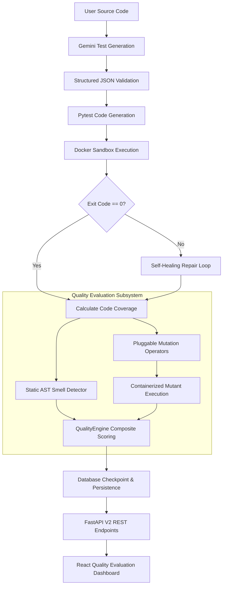

# TestGen AI v2.2

> **Enterprise-Grade AI-Powered Automated Unit Test Generation & Quality Evaluation System**

TestGen AI v2.2 is an advanced automated unit test generation and quality evaluation platform for Python applications. By combining LLM-based test generation, structured schema validation, isolated Docker container execution, `coverage.py` analysis, closed-loop **Self-Healing Test Generation**, **Static AST Test Smell Detection**, **Pluggable Mutation Operators**, **Weighted Quality Scoring**, and a modern **React Quality Evaluation Dashboard**, TestGen AI ensures high-quality, executable unit tests with empirical verification.

---

## Features

- **✓ AI-Powered Test Generation**: Generates comprehensive `pytest` test suites using Google Gemini models.
- **✓ Static AST Test Smell Detection**: Deterministic 0ms inspection of test code using built-in Python `ast` rules (Assertion Roulette, Duplicate Assertions, Empty Tests, Magic Numbers, Verbose Tests, Conditional Logic).
- **✓ Pluggable Mutation Testing Framework**: Strategy-pattern operator execution (`Arithmetic`, `Comparison`, `Boolean`, `ConstantReplacement`, `Unary`, `ReturnValue`) with isolated Docker container mutant execution.
- **✓ QualityEngine Composite Scoring**: Weighted scoring formula ($0.4 \times \text{Coverage} + 0.4 \times \text{Mutation} + 0.2 \times \text{SmellHygiene}$) assigning rating badges (`EXCELLENT`, `GOOD`, `FAIR`, `POOR`).
- **✓ Self-Healing Test Generation**: Automatically detects, classifies, and surgically repairs failing unit tests in a closed execution loop.
- **✓ Docker Sandbox Execution**: Safely executes generated tests and mutants in isolated, resource-bounded Docker containers (`cpus: 1.0`, `memory: 256m`, `--network none`).
- **✓ Statement & Branch Coverage**: Computes line coverage, branch coverage, and statement counters via `coverage.py`.
- **✓ Interactive React Quality Dashboard**: Responsive frontend built with React 19, TypeScript, Vite, Tailwind CSS, and Monaco Editor. Features metric cards, progress indicators, 8-stage pipeline timeline, and filterable/sortable mutant detail table.
- **✓ Decoupled Async Workflow**: Async job lifecycle engine (`/api/v2/jobs/generate`) with atomic claiming and startup crash recovery.
- **✓ FastAPI REST API**: High-performance API backend with RFC 7807 Problem Details error formatting.

---

## Architecture

The TestGen AI v2.2 pipeline processes source code through an automated generation, execution, self-healing, quality evaluation, and presentation workflow:



---

## Technology Stack

| Layer | Technology / Tools |
| :--- | :--- |
| **Frontend** | React 19, TypeScript 5, Vite 6, Tailwind CSS v4, Zustand 5, Monaco Editor |
| **Backend API** | Python 3.11+, FastAPI, Pydantic v2, Uvicorn, Structlog |
| **Domain Engine** | Python `ast`, Strategy-Pattern Mutation Operators, QualityEngine |
| **Database & ORM** | SQLite / PostgreSQL, SQLAlchemy 2.0, Alembic Migrations |
| **AI Provider** | Google Gemini API (`google-genai` SDK) |
| **Containerization** | Docker, Python 3.11 Slim Image, Pytest, Coverage.py |

---

## Installation & Quickstart

### Prerequisites
- Python 3.11+
- Node.js 18+ / npm
- Docker Desktop

### 1. Clone & Setup Backend
```bash
cd backend
python -m venv .venv
# Windows:
.venv\Scripts\activate
# Linux/macOS:
source .venv/bin/activate

pip install -r requirements.txt
cp .env.example .env
```

### 2. Configure Environment (`.env`)
```env
GEMINI_API_KEY=your_gemini_api_key_here
DATABASE_URL=sqlite:///./testgen.db
ENABLE_QUALITY_EVALUATION=true
ENABLE_MUTATION_TESTING=true
ENABLE_SELF_HEAL=true
MAX_MUTANTS=20
EXECUTION_TIMEOUT=30
```

### 3. Run Backend Server
```bash
uvicorn main:app --reload --port 8000
```

### 4. Setup & Run React Frontend
```bash
cd ../frontend
npm install
npm run dev
```

The React Quality Dashboard will be accessible at `http://localhost:5173`.

---

## API Overview (v2 Endpoints)

| Method | Endpoint | Description |
|---|---|---|
| `POST` | `/api/v2/jobs/generate` | Submit async test generation job |
| `GET` | `/api/v2/jobs/{job_id}` | Fetch job lifecycle status and embedded quality metrics |
| `GET` | `/api/v2/jobs/{job_id}/quality` | Fetch Quality Metrics sub-resource |
| `GET` | `/api/v2/jobs/{job_id}/mutation-summary` | Fetch Mutation Summary sub-resource |
| `GET` | `/api/v2/jobs/{job_id}/smells` | Fetch Test Smells Diagnostic summary |

---

## Running Tests

### Backend Test Suite
```bash
cd backend
python -m pytest tests/v2/ -v
```

### Frontend Production Build Verification
```bash
cd frontend
npm run build
```

---

## Documentation Links

- **Architecture Specification**: [ARCHITECTURE_v2.2.md](file:///c:/Users/hp/Desktop/LLM_CIA%203/TestGenAI/docs/ARCHITECTURE_v2.2.md)
- **Performance Benchmarks**: [BENCHMARKS_v2.2.md](file:///c:/Users/hp/Desktop/LLM_CIA%203/TestGenAI/docs/BENCHMARKS_v2.2.md)
- **Deployment Checklist**: [DEPLOYMENT_CHECKLIST_v2.2.md](file:///c:/Users/hp/Desktop/LLM_CIA%203/TestGenAI/docs/DEPLOYMENT_CHECKLIST_v2.2.md)
- **Changelog**: [CHANGELOG.md](file:///c:/Users/hp/Desktop/LLM_CIA%203/TestGenAI/CHANGELOG.md)
- **Release Notes**: [RELEASE_NOTES.md](file:///c:/Users/hp/Desktop/LLM_CIA%203/TestGenAI/RELEASE_NOTES.md)

---

## License

This project is licensed under the MIT License — see the `LICENSE` file for details.
