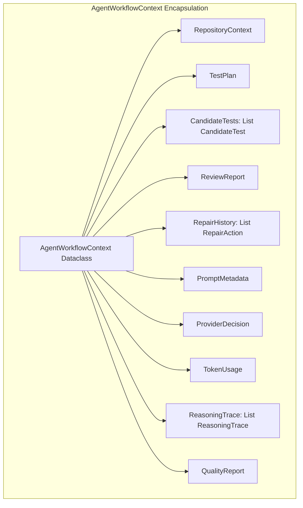
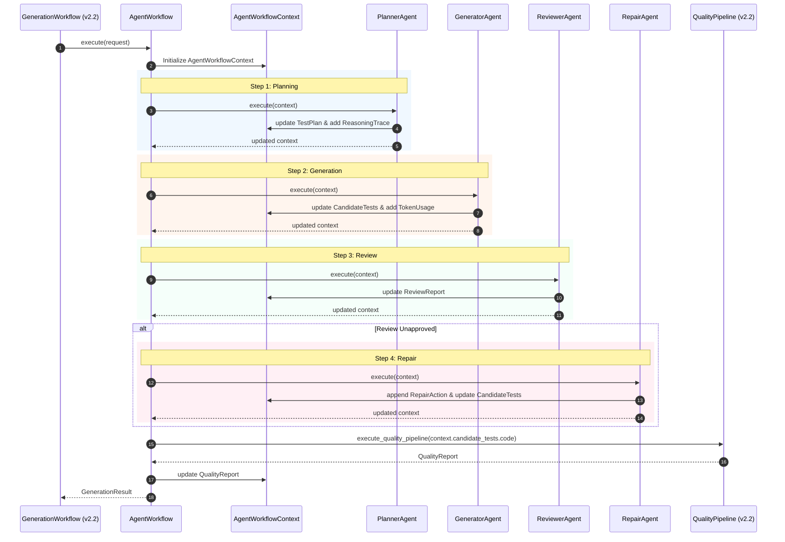

# TestGen AI v2.3 — Final Refined Architecture Specification

**Document Version**: 2.5.0  
**Status**: Approved & Frozen Final Architectural Baseline  
**Target Release**: TestGen AI v2.3  

---

## 1. Executive Summary & Final Refinement Rationale

This document presents the **Final Refined Architecture Specification** for TestGen AI v2.3. This final refinement incorporates three crucial structural patterns:
1. **Platform Domain Layer (`app/domain/`)**: Shared, strongly typed domain models (`GenerationRequest`, `RepositoryContext`, `TestPlan`, `CandidateTest`, `ReviewReport`, `RepairAction`, `AgentWorkflowContext`, etc.) establishing enterprise contracts between layers.
2. **Shared Agent Workflow Context (`AgentWorkflowContext`)**: Unified state container passed to all cognitive agents via `execute(context: AgentWorkflowContext) -> AgentWorkflowContext`.
3. **Pluggable Provider Routing Strategies (`BaseRoutingStrategy`)**: Open/Closed strategy architecture for LLM selection (`LatencyStrategy`, `CostStrategy`, `BalancedStrategy`, `QualityStrategy`, `ResearchStrategy`).

---

## 2. Refined Layered Architecture

```mermaid
graph TD
    Client[React Quality Dashboard / API Client] -->|HTTP REST| API[FastAPI V2 Gateway]
    
    subgraph Layer 1: Presentation & API Layer
        API
    end

    subgraph Layer 2: Workflow Layer
        API --> GenWorkflow[GenerationWorkflow v2.2]
        GenWorkflow --> AgentWork[AgentWorkflow NEW]
    end

    subgraph Layer 3: Platform Domain Model Layer NEW
        AgentWork --> DomainCtx[AgentWorkflowContext]
        DomainCtx --> DomainModels[TestPlan | CandidateTest | ReviewReport | RepairAction | QualityReport | TokenUsage]
    end

    subgraph Layer 4: Reasoning Agent Layer
        AgentWork --> Planner[PlannerAgent]
        Planner --> Generator[GeneratorAgent]
        Generator --> Reviewer[ReviewerAgent]
        Reviewer --> Repair[RepairAgent]
    end

    subgraph Layer 5: Infrastructure & Service Layer
        Planner & Generator & Reviewer & Repair --> RepoIndex[RepositoryContextIndex]
        Planner & Generator & Reviewer & Repair --> PromptMgr[PromptManager]
        PromptMgr --> PromptRepo[PromptRepository]
        PromptMgr --> PromptBld[PromptBuilder]
        PromptMgr --> Router[LLMProviderRouter]
        Router --> Evaluator[ProviderEvaluator]
        Evaluator --> Strategies[BaseRoutingStrategy: Latency | Cost | Balanced | Quality | Research]
        Strategies --> Providers[Gemini | Claude | OpenAI | Ollama]
        
        AgentWork --> TokenTrack[TokenCostTracker]
        AgentWork --> TraceLog[ReasoningTraceLogger]
        AgentWork --> Cache[ContextCache]
    end

    subgraph Layer 6: Quality & Execution Layer v2.2 Baseline
        Repair --> QualityPipe[QualityPipeline v2.2]
        QualityPipe --> Docker[Docker Sandbox]
        QualityPipe --> Coverage[Coverage.py Engine]
        QualityPipe --> Smell[TestSmellDetector]
        QualityPipe --> Mutation[MutationRunner]
        QualityPipe --> Scorer[QualityEngine]
    end

    subgraph Layer 7: Persistence Layer v2.2 Baseline
        GenWorkflow --> DB[(Database Persistence Layer)]
    end
```

---

## 3. Platform Domain Model Layer Specification (`app/domain/`)

The Domain Layer defines shared platform dataclasses that represent enterprise business concepts. They contain no I/O, database logic, or framework dependencies.

| Model Name | Purpose | Key Attributes | Shared Boundaries |
|---|---|---|---|
| **`GenerationRequest`** | Represents incoming test generation request payload | `source_code`, `specification`, `language`, `framework`, `user_id` | API Layer $\rightarrow$ Workflow Layer |
| **`GenerationResult`** | Final consolidated output returned to callers | `job_id`, `generated_code`, `quality_metrics`, `traces`, `token_summary` | Workflow Layer $\rightarrow$ API Layer |
| **`RepositoryContext`** | Workspace AST information, AST call graph, fixtures | `imports`, `custom_types`, `pytest_fixtures`, `helper_functions` | Infrastructure $\rightarrow$ Domain Context |
| **`TestPlan`** | Structured testing blueprint generated by `PlannerAgent` | `target_functions`, `test_cases`, `mock_requirements`, `edge_cases` | `PlannerAgent` $\rightarrow$ `GeneratorAgent` |
| **`CandidateTest`** | Generated candidate test case representation | `test_code`, `test_name`, `target_function`, `imports` | `GeneratorAgent` $\rightarrow$ `ReviewerAgent` |
| **`ReviewReport`** | Static analysis feedback from `ReviewerAgent` | `is_approved`, `flaws`, `missing_assertions`, `smell_diagnostics` | `ReviewerAgent` $\rightarrow$ `RepairAgent` |
| **`RepairAction`** | Surgical repair instructions formulated by `RepairAgent` | `repair_type`, `original_code`, `repaired_code`, `reason` | `RepairAgent` $\rightarrow$ Workflow |
| **`ProviderDecision`** | LLM model choice decision metadata | `selected_provider`, `strategy_used`, `estimated_cost`, `latency_ms` | Infrastructure $\rightarrow$ Context |
| **`PromptPayload`** | Rendered prompt text and variable substitution metadata | `template_name`, `rendered_system`, `rendered_user`, `version` | Infrastructure $\rightarrow$ Agents |
| **`QualityReport`** | Consolidated result from `QualityPipeline` | `overall_score`, `rating`, `line_coverage`, `mutation_score`, `smells` | Quality Layer $\rightarrow$ Context |
| **`ReasoningTrace`** | Step-by-step cognitive agent decision entry | `timestamp`, `agent_name`, `step_action`, `rationale_summary` | Agents $\rightarrow$ Context |
| **`TokenUsage`** | Real-time input/output token counters and costs | `prompt_tokens`, `completion_tokens`, `total_tokens`, `cost_usd` | Infrastructure $\rightarrow$ Context |
| **`AgentWorkflowContext`**| Centralized mutable state container for `AgentWorkflow` | *See Section 4 below* | Workflow $\rightarrow$ Agents |

---

## 4. `AgentWorkflowContext` Architecture

Every cognitive agent implements the uniform execution contract:
$$\text{execute}(\text{context}: \text{AgentWorkflowContext}) \rightarrow \text{AgentWorkflowContext}$$



### Context Lifecycle & Update Rules
1. **Creation**: Initialized at the start of `AgentWorkflow.execute()` with `GenerationRequest` and `RepositoryContext`.
2. **Immutability & Safety**: Sub-objects (`RepositoryContext`, `TestPlan`, `ReviewReport`) are immutable dataclasses. Updating a sub-object replaces the reference on `AgentWorkflowContext`.
3. **Append-Only Auditing**: `RepairHistory`, `ReasoningTrace`, and `TokenUsage` are append-only lists guaranteeing a complete execution audit trail.

---

## 5. Pluggable Routing Strategies Architecture

`ProviderEvaluator` delegates model selection to interchangeable strategy classes adhering to `BaseRoutingStrategy`:

```mermaid
graph TD
    Router[LLMProviderRouter] --> Evaluator[ProviderEvaluator Engine]
    Evaluator -->|Delegates Selection| BaseStrategy[BaseRoutingStrategy ABC]
    
    BaseStrategy <|-- LatencyStrategy[LatencyStrategy: Minimizes Roundtrip Time]
    BaseStrategy <|-- CostStrategy[CostStrategy: Minimizes Token Expense]
    BaseStrategy <|-- BalancedStrategy[BalancedStrategy: Default Quality/Cost Balance]
    BaseStrategy <|-- QualityStrategy[QualityStrategy: Selects Highest Rated Model]
    BaseStrategy <|-- ResearchStrategy[ResearchStrategy: Comparative Multi-Model Run]

    Evaluator -->|Executes Selected Provider| Providers[Gemini | Claude | OpenAI | Ollama]
```

---

## 6. Refined Agent Interaction Sequence



---

## 7. Extension Point Matrix (Open/Closed Principle)

```
Extension Point                Interface / Base Class            How New Additions Are Plugged In
─────────────────────────────────────────────────────────────────────────────────────────────────────────────
New Domain Models         -->  BaseDomainModel (Dataclass)   --> Add dataclass to app/domain/
New Cognitive Agents      -->  BaseAgent (ABC)               --> Implement execute(ctx) -> ctx; register in AgentWorkflow
New Routing Strategies    -->  BaseRoutingStrategy (ABC)     --> Implement select_provider(); register in ProviderEvaluator
New LLM Providers         -->  BaseLLMProvider (ABC)         --> Implement generate(); register in LLMProviderRouter
New Prompt Templates      -->  PromptTemplate                --> Add template file to app/infrastructure/prompts/
New Quality Metrics       -->  BaseQualityRule (ABC)         --> Implement evaluate(); add to QualityPipeline (v2.2)
```

---

## 8. Final Architectural Rationale & Approval Confirmation

1. **Enterprise Domain Contracts**: The introduction of `app/domain/` establishes unambiguous shared business models that prevent layer coupling.
2. **Context Standardization**: `AgentWorkflowContext` eliminates ad-hoc parameter lists across agent methods.
3. **Pluggable LLM Routing**: `BaseRoutingStrategy` allows users to optimize for cost, latency, or quality without modifying core provider clients.
4. **100% Frozen Baseline**: The v2.2 execution substrate (`QualityPipeline`, `QualityEngine`, AST smell rules, and pluggable mutation operators) remains untouched.

**Final Approval Status**: The architecture for TestGen AI v2.3 is **APPROVED and FROZEN**. Phase 1 implementation can now proceed.
