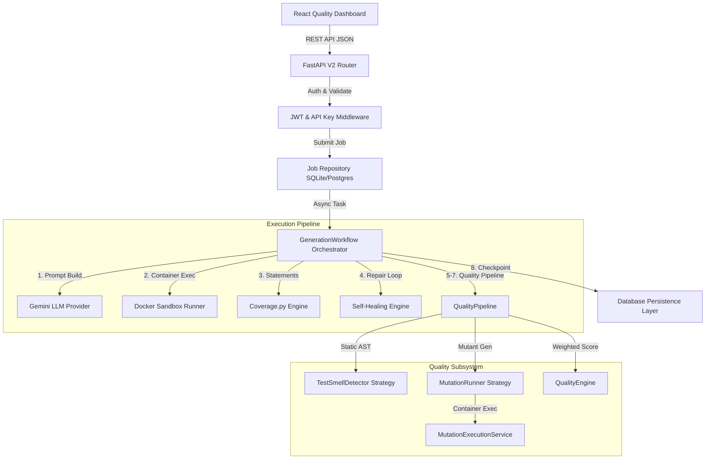
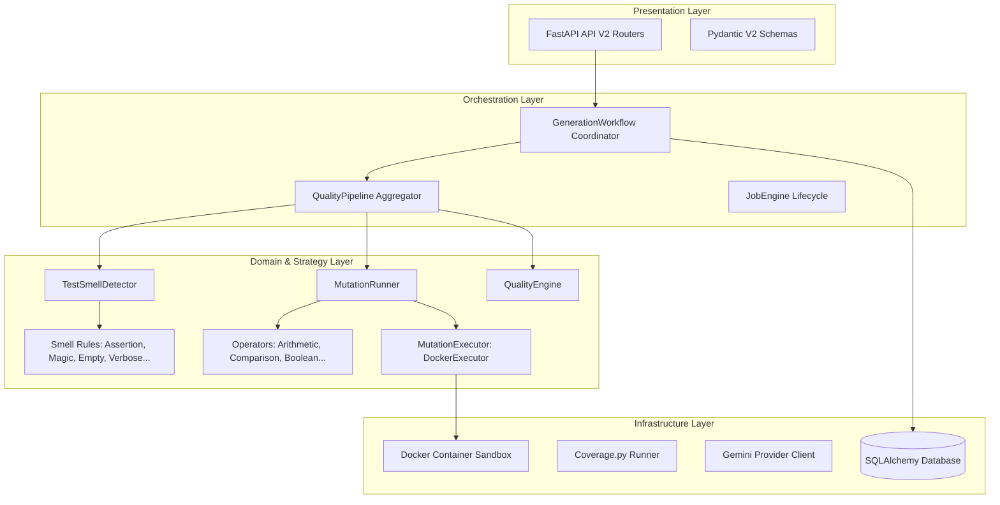
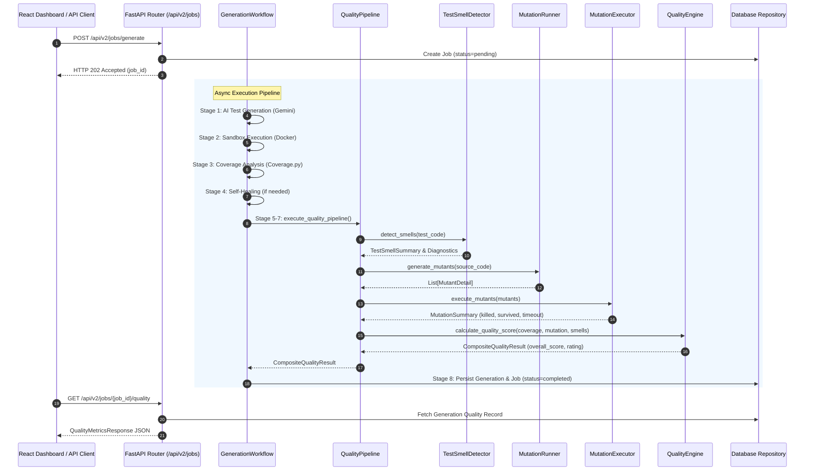
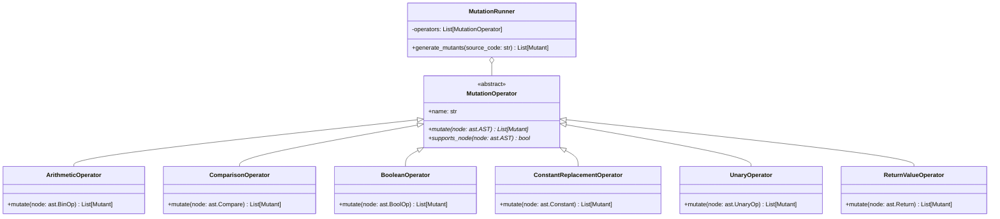
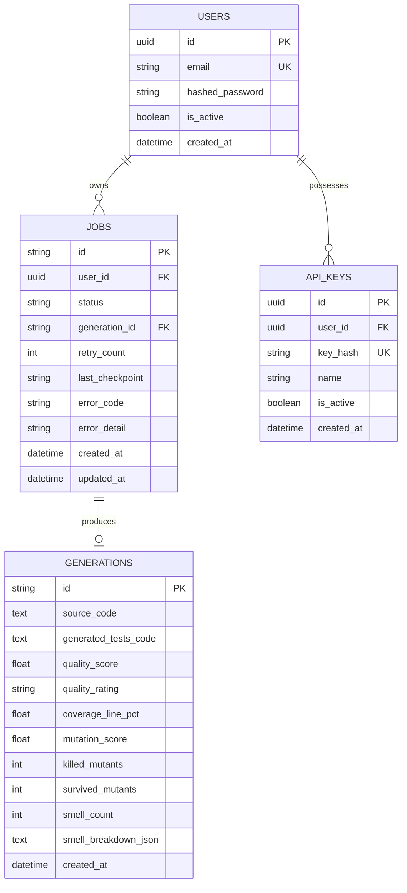

# TestGen AI v2.2 — System Architecture Specification

**Version**: 2.2.0  
**Status**: Frozen Baseline Architecture  
**Author**: TestGen AI Architecture Review Board  

---

## 1. Executive Architecture Summary

TestGen AI v2.2 expands the v2.1 baseline by introducing a comprehensive **Quality Evaluation Subsystem**. While v2.1 focused on generating, sandboxing, and self-healing tests, v2.2 introduces static test smell detection, pluggable mutation operator execution, weighted quality scoring, and a dedicated presentation dashboard.

The architecture enforces strict decoupling:
- **`JobEngine`**: Manages async job state transitions, atomic claiming, and startup recovery.
- **`GenerationWorkflow`**: Orchestrates the 8-stage generation lifecycle.
- **`QualityPipeline`**: Coordinates smell detection, mutant generation, mutant execution, and scoring.
- **React Frontend**: Pure presentation layer consuming REST endpoints.

---

## 2. Overall System Architecture



---

## 3. Backend Layered Architecture



---

## 4. GenerationWorkflow & QualityPipeline Sequence



---

## 5. Mutation Framework (Strategy & Open/Closed Design)



---

## 6. React Component Hierarchy

```mermaid
graph TD
    App[App.jsx / Router] --> Protected[ProtectedRoute]
    Protected --> Layout[AppLayout]
    Layout --> Workspace[DashboardPage / JobDetails]
    
    Workspace --> ResultPanel[ResultPanel.jsx]
    ResultPanel --> Tabs[Tab Bar: Summary | Quality | Tests | Code | Sandbox]
    
    Tabs --> QualityDash[QualityDashboard.tsx Container]
    QualityDash --> ErrorBound[ErrorBoundary.tsx]
    
    ErrorBound --> Banner[Job Summary Banner]
    ErrorBound --> Timeline[PipelineTimeline.tsx]
    ErrorBound --> QCard[QualityCard.tsx]
    ErrorBound --> CCard[CoverageCard.tsx]
    ErrorBound --> MCard[MutationCard.tsx]
    ErrorBound --> SCard[SmellCard.tsx]
    ErrorBound --> MTable[MutationTable.tsx]
    
    QCard --> ProgressCard[ProgressCard.tsx]
    QCard --> StatusBadge[StatusBadge.tsx]
    CCard --> ProgressCard
    MCard --> ProgressCard
    SCard --> StatusBadge
    MTable --> StatusBadge
```

---

## 7. Database Entity Relationship Diagram (ERD)


